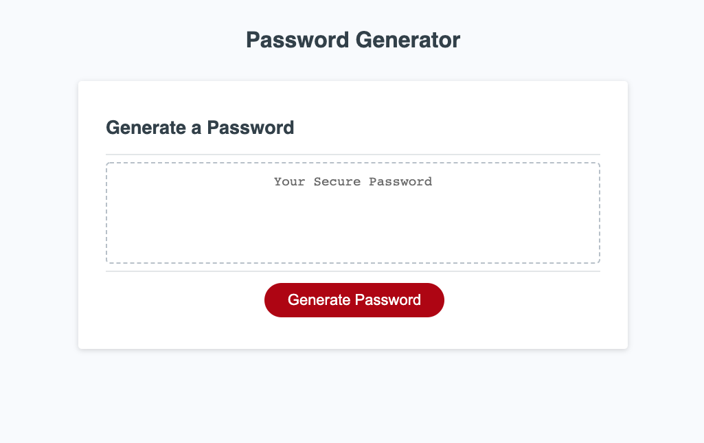
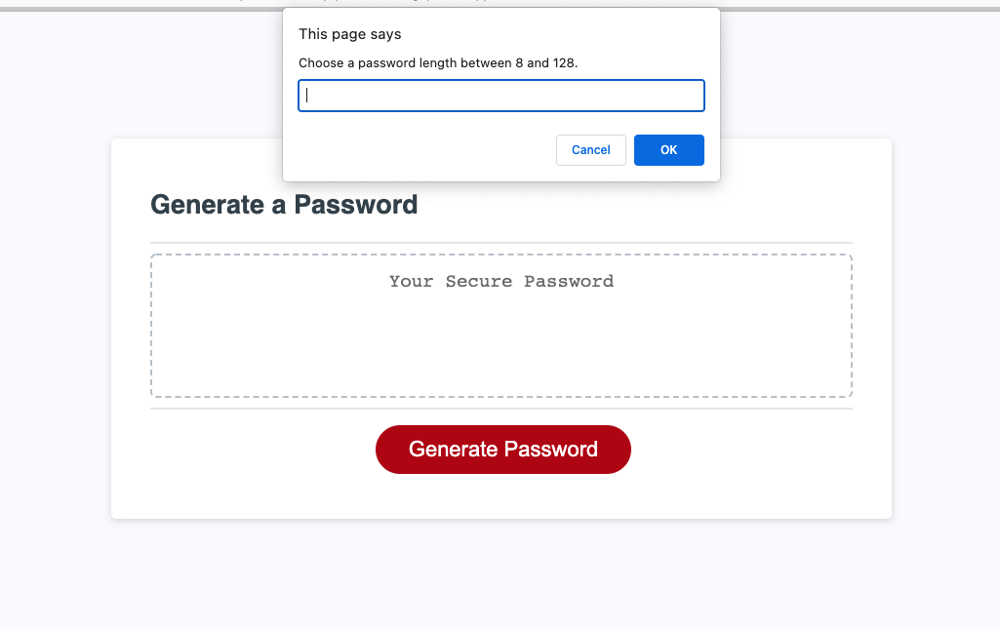
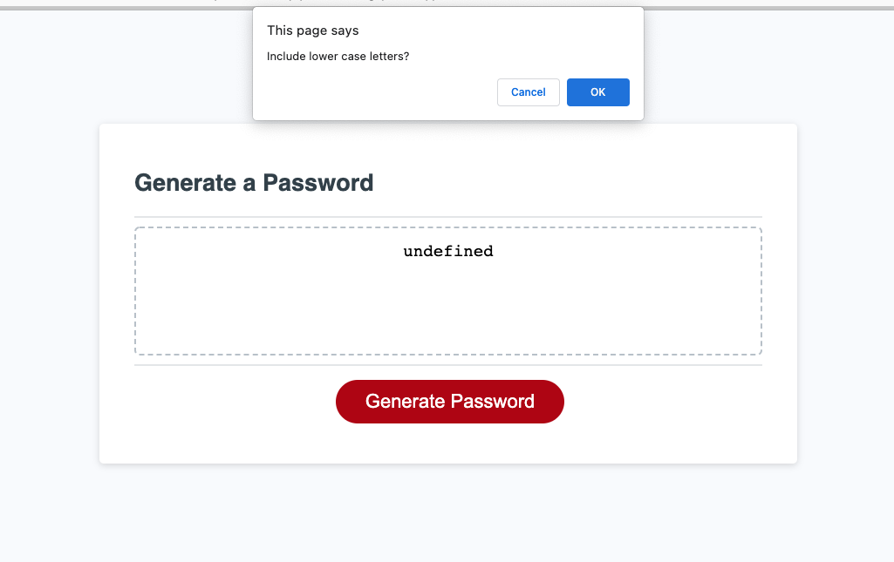
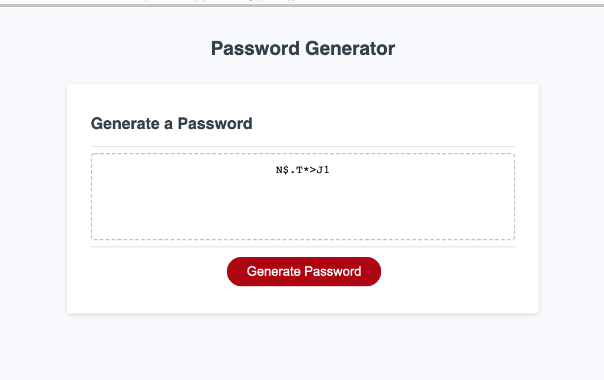

# JavaScript: Password Generator

## Description

- This project helps people generate a secure password given their desired critiera for length and characters.
- I built this project to improve my JavaScript skills and logic.
- This project provides safe passwords that are difficult to guess for a variety of accounts or uses.
- I learned more about variables, functions, objects, arrays, and logic in JavaScript.

## Installation

- Open your chosen browser.
- Copy and paste URL into browser: https://ericaemorabito.github.io/Password_Generator/
- Click on red button labeled "Generate Password".

- Enter your desired password length between 8 and 128 characters.

- Confirm your choice to include lowercase letters, uppercase, letters, numbers and special characters in your password with the "OK" button.

- View your generated password in the text area.

## Usage

- Follow the installation instructions for usage.
- Use this webpage to generate a random password for any number of accounts determined by choice of characters to include.

### Credits

* This project wouldn't have been completed without the help of my tutor Wesley Clements, my AskBCS helper Benjamin, and TAs Mike Rivera and Alex.
